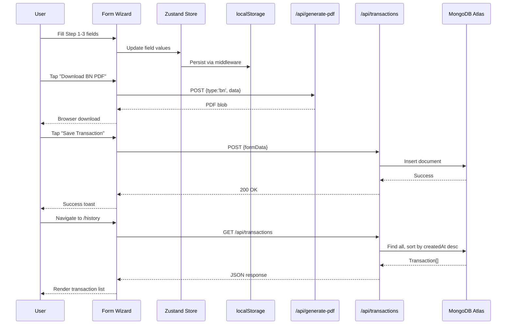
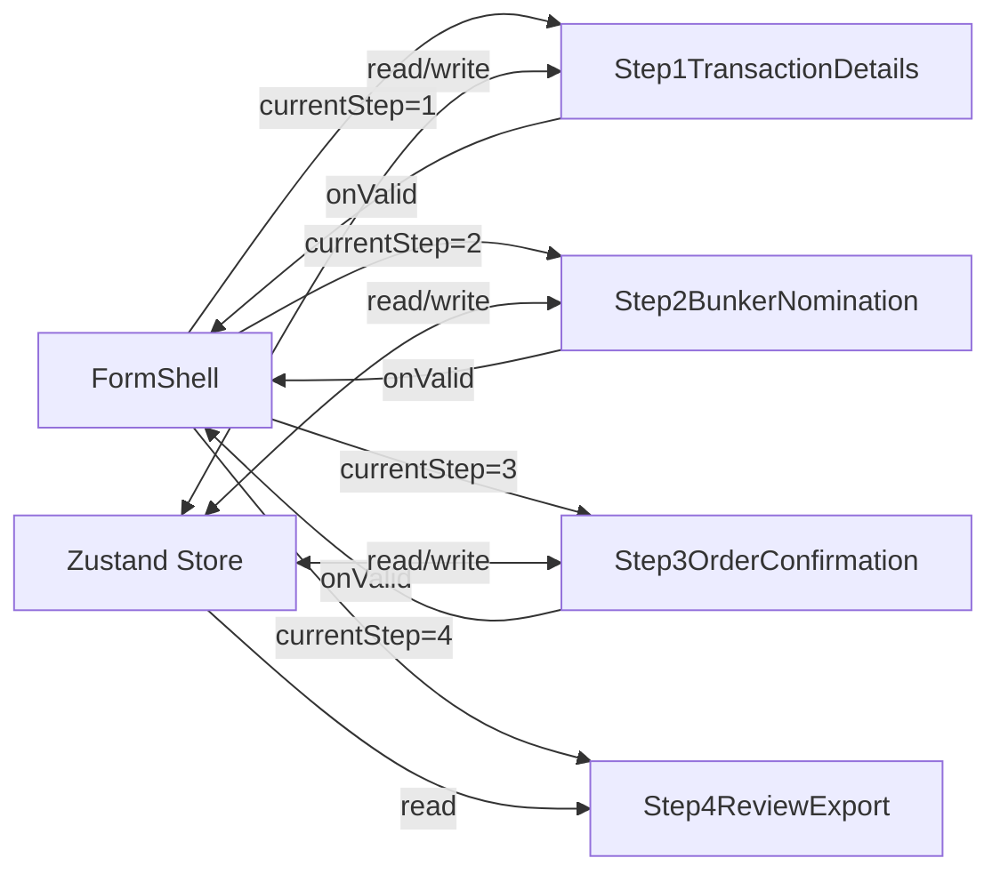

# Design Document: ASEAN Document Generator

## Overview

The ASEAN Document Generator is a greenfield mobile-first Next.js 14 web application for ASEAN International DMCC, a marine fuel (bunker) trading company. The application enables the ASEAN team to fill out a 4-step form wizard and instantly generate two PDF documents per transaction: a **Bunker Nomination** (sent to the fuel supplier/trader) and an **Order Confirmation** (sent to the buyer/client). Completed transactions are persisted to MongoDB Atlas for historical review and re-export.

### Key Design Decisions

1. **Server-side PDF generation via API route**: PDFs are rendered server-side using `@react-pdf/renderer` in a Next.js API route (`/api/generate-pdf`). This avoids bundling the PDF renderer on the client, keeps bundle size small, and works reliably on Vercel serverless.

2. **Client-side Excel export**: The `xlsx` package runs entirely in the browser. This avoids server round-trips for spreadsheet generation and keeps the Excel export fast and offline-capable.

3. **Zustand with persist middleware over React Hook Form state**: Cross-step form data lives in a Zustand store persisted to localStorage. React Hook Form is used per-step for validation and field management, but the source of truth is Zustand. This ensures data survives browser refreshes and enables the re-export flow from history.

4. **MongoDB Node.js driver (not Mongoose)**: Direct driver usage with connection caching via `global._mongoClientPromise` is the recommended pattern for Vercel serverless. It avoids Mongoose's schema overhead for a simple single-collection use case.

5. **Mobile-first responsive design**: All layouts are designed for 375px minimum width first, then enhanced for tablet/desktop at the 768px breakpoint.

## Architecture

### High-Level Architecture

```mermaid
graph TB
    subgraph Client ["Browser (Client)"]
        A[Next.js App Router Pages]
        B[Zustand Store + localStorage]
        C[React Hook Form + Zod]
        D[xlsx Package]
    end

    subgraph Server ["Vercel Serverless"]
        E["/api/generate-pdf (POST)"]
        F["/api/transactions (GET/POST)"]
        G["@react-pdf/renderer"]
    end

    subgraph DB ["MongoDB Atlas"]
        H[transactions collection]
    end

    A --> B
    A --> C
    A --> D
    A -->|POST {type, data}| E
    A -->|GET/POST| F
    E --> G
    F --> H
```

### Request Flow



## Components and Interfaces

### Page Components

| Component | Path | Responsibility |
|-----------|------|----------------|
| `app/page.tsx` | `/` | Redirects to `/form` |
| `app/form/page.tsx` | `/form` | Renders `FormShell` with step routing |
| `app/history/page.tsx` | `/history` | Fetches and displays transaction history |

### Form Components

| Component | File | Responsibility |
|-----------|------|----------------|
| `FormShell` | `components/form/FormShell.tsx` | Step progress bar, card wrapper, sticky action bar, step navigation logic |
| `Step1TransactionDetails` | `components/form/Step1TransactionDetails.tsx` | Shared transaction fields with React Hook Form + Zod validation |
| `Step2BunkerNomination` | `components/form/Step2BunkerNomination.tsx` | Supplier-specific fields |
| `Step3OrderConfirmation` | `components/form/Step3OrderConfirmation.tsx` | Buyer-specific fields |
| `Step4ReviewExport` | `components/form/Step4ReviewExport.tsx` | Read-only summary cards + export action buttons |

### PDF Components

| Component | File | Responsibility |
|-----------|------|----------------|
| `BunkerNominationDocument` | `components/pdf/BunkerNominationDocument.tsx` | `@react-pdf/renderer` component for BN PDF (2 pages) |
| `OrderConfirmationDocument` | `components/pdf/OrderConfirmationDocument.tsx` | `@react-pdf/renderer` component for OC PDF (2 pages) |

### Shell Components

| Component | File | Responsibility |
|-----------|------|----------------|
| `TopNav` | `components/TopNav.tsx` | Brand text, app name, nav links, theme toggle |
| `ThemeToggle` | `components/ThemeToggle.tsx` | Dark/light mode toggle using `next-themes` |

### API Routes

| Route | Method | File | Responsibility |
|-------|--------|------|----------------|
| `/api/generate-pdf` | POST | `app/api/generate-pdf/route.ts` | Accepts `{type: 'bn'|'oc', data}`, renders PDF server-side, returns blob |
| `/api/transactions` | GET | `app/api/transactions/route.ts` | Returns all transactions sorted by `createdAt` desc |
| `/api/transactions` | POST | `app/api/transactions/route.ts` | Inserts a new transaction record |

### Utility Modules

| Module | File | Responsibility |
|--------|------|----------------|
| `mongodb` | `lib/mongodb.ts` | MongoDB connection caching via `global._mongoClientPromise` |
| `store` | `lib/store.ts` | Zustand store with persist middleware for form state |
| `schemas` | `lib/schemas.ts` | Zod validation schemas for all 4 steps |
| `excel` | `lib/excel.ts` | Excel export logic using `xlsx` package |

### Component Interaction: FormShell ↔ Step Components



Each step component:
- Reads initial values from the Zustand store
- Uses React Hook Form for local field management and validation
- On field change, syncs the value back to the Zustand store
- On "Next", validates via Zod schema; if valid, calls `onValid()` callback to advance

`FormShell`:
- Manages `currentStep` state (1-4)
- Renders the `StepProgressIndicator` and the active step component
- Renders the `StickyActionBar` with Back/Next/Export buttons based on current step

## Data Models

### Zustand Form Store (`lib/store.ts`)

```typescript
interface FormState {
  // Step 1 — Transaction Details
  date: string;
  vesselNameImo: string;
  port: string;
  eta: string;
  product: string;
  quantity: string;
  deliveryMode: string;
  agents: string;
  physicalSupplier: string;
  signatory: string;

  // Step 2 — Bunker Nomination
  bn_to: string;
  bn_attn: string;
  bn_sellers: string;
  bn_suppliers: string;
  bn_buyingPrice: string;
  bn_paymentTerms: string;
  bn_remarks: string;

  // Step 3 — Order Confirmation
  oc_to: string;
  oc_attn: string;
  oc_buyers: string;
  oc_sellingPrice: string;
  oc_paymentTerms: string;
  oc_remarks: string;

  // Actions
  setField: (field: string, value: string) => void;
  setAllFields: (data: Partial<FormState>) => void;
  resetForm: () => void;
}
```

### Zod Schemas (`lib/schemas.ts`)

```typescript
// Step 1 schema
const step1Schema = z.object({
  date: z.string().min(1, "Date is required"),
  vesselNameImo: z.string().min(1, "Vessel Name & IMO is required"),
  port: z.string().min(1, "Port is required"),
  eta: z.string().min(1, "ETA is required"),
  product: z.string().min(1, "Product is required"),
  quantity: z.string().min(1, "Quantity is required"),
  deliveryMode: z.string().min(1, "Delivery Mode is required"),
  agents: z.string().min(1, "Agents is required"),
  physicalSupplier: z.string().min(1, "Physical Supplier is required"),
  signatory: z.string().optional().default("Sahir Jamal"),
});

// Step 2 schema
const step2Schema = z.object({
  bn_to: z.string().min(1, "To is required"),
  bn_attn: z.string().min(1, "Attn is required"),
  bn_sellers: z.string().min(1, "Sellers is required"),
  bn_suppliers: z.string().optional(),
  bn_buyingPrice: z.string().min(1, "Buying Price is required"),
  bn_paymentTerms: z.string().optional(),
  bn_remarks: z.string().optional(),
});

// Step 3 schema
const step3Schema = z.object({
  oc_to: z.string().min(1, "To is required"),
  oc_attn: z.string().min(1, "Attn is required"),
  oc_buyers: z.string().min(1, "Buyers is required"),
  oc_sellingPrice: z.string().min(1, "Selling Price is required"),
  oc_paymentTerms: z.string().optional(),
  oc_remarks: z.string().optional(),
});

// Step 4 has no validation — it's read-only
```

### Transaction Record (`types/transaction.ts`)

```typescript
interface TransactionRecord {
  _id?: string;

  // Step 1 fields
  date: string;
  vesselNameImo: string;
  port: string;
  eta: string;
  product: string;
  quantity: string;
  deliveryMode: string;
  agents: string;
  physicalSupplier: string;
  signatory: string;

  // Step 2 fields (Bunker Nomination)
  bn_to: string;
  bn_attn: string;
  bn_sellers: string;
  bn_suppliers: string;
  bn_buyingPrice: string;
  bn_paymentTerms: string;
  bn_remarks: string;

  // Step 3 fields (Order Confirmation)
  oc_to: string;
  oc_attn: string;
  oc_buyers: string;
  oc_sellingPrice: string;
  oc_paymentTerms: string;
  oc_remarks: string;

  // Metadata
  createdAt: Date;
}
```

### MongoDB Connection (`lib/mongodb.ts`)

```typescript
// Connection caching pattern for Vercel serverless
// MONGODB_URI will be provided as environment variable — see .env.local.example

import { MongoClient } from "mongodb";

const uri = process.env.MONGODB_URI;
const options = {};

let client: MongoClient;
let clientPromise: Promise<MongoClient>;

declare global {
  var _mongoClientPromise: Promise<MongoClient> | undefined;
}

if (!uri) {
  // Mock mode — no database connection
  console.warn("MONGODB_URI not set — running in mock mode");
} else if (process.env.NODE_ENV === "development") {
  if (!global._mongoClientPromise) {
    client = new MongoClient(uri, options);
    global._mongoClientPromise = client.connect();
  }
  clientPromise = global._mongoClientPromise;
} else {
  client = new MongoClient(uri, options);
  clientPromise = client.connect();
}

export default clientPromise;
```

### PDF API Route (`app/api/generate-pdf/route.ts`)

```typescript
// POST handler
interface GeneratePdfRequest {
  type: "bn" | "oc";
  data: Omit<TransactionRecord, "_id" | "createdAt">;
}

// Response: PDF blob with Content-Type: application/pdf
// Content-Disposition: attachment; filename="BunkerNomination_<vessel>.pdf"
```

### Transactions API Route (`app/api/transactions/route.ts`)

```typescript
// GET: Returns TransactionRecord[] sorted by createdAt desc
// POST: Accepts Omit<TransactionRecord, '_id' | 'createdAt'>, returns { success: true, id: string }
// Mock mode: If MONGODB_URI not set, POST logs to console, GET returns []
```

### Excel Export (`lib/excel.ts`)

```typescript
interface ExcelExportInput {
  // All form fields from the Zustand store
  // Same shape as Omit<TransactionRecord, '_id' | 'createdAt'>
}

// generateExcel(data: ExcelExportInput): void
// Creates a workbook with two sheets:
//   - "Bunker Nomination": BN-relevant fields in label/value rows
//   - "Order Confirmation": OC-relevant fields in label/value rows
// Triggers browser download with filename:
//   ASEAN_<VesselFirstWord>_<PortFirstWord>_<Date>.xlsx
```

## Correctness Properties

*A property is a characteristic or behavior that should hold true across all valid executions of a system — essentially, a formal statement about what the system should do. Properties serve as the bridge between human-readable specifications and machine-verifiable correctness guarantees.*

### Property 1: Form data localStorage round-trip

*For any* valid set of form field values, persisting them to the Zustand store (which writes to localStorage via persist middleware) and then creating a new store instance that rehydrates from localStorage should produce a store state with identical field values.

**Validates: Requirements 8.2, 8.3**

### Property 2: Validation gates step advancement

*For any* set of form field values on a given step, the step advances to the next step if and only if the Zod schema for that step validates successfully. If validation fails, the current step number remains unchanged.

**Validates: Requirements 6.1, 6.4, 6.5**

### Property 3: Back navigation preserves form data

*For any* set of form field values entered across steps 1-3, navigating backward from any step should preserve all previously entered field values in the Zustand store without modification.

**Validates: Requirements 7.2**

### Property 4: Review summary completeness

*For any* valid complete form data (all required fields populated), the Step 4 review summary should display every field value from the form data as a label/value row within the appropriate summary card (BN fields in the BN card, OC fields in the OC card, shared fields in both).

**Validates: Requirements 5.4**

### Property 5: Bunker Nomination document field completeness

*For any* valid complete form data, the rendered Bunker Nomination PDF document should contain all dynamic field values from the form data (To, Attn, Date, Vessel, Port, ETA, Product, Quantity, Price, Delivery mode, Sellers, Suppliers, Agents, Payment, Remarks, Signatory) and the hardcoded value "Asean International DMCC" for Buyers.

**Validates: Requirements 9.3**

### Property 6: Order Confirmation document field completeness

*For any* valid complete form data, the rendered Order Confirmation PDF document should contain all dynamic field values from the form data (To, Attn, Date, Vessel, Port, ETA, Product, Quantity, Price, Delivery Mode, Buyers, Supplier, Agents, Remarks, Payment, Signatory) and the hardcoded value "Asean International DMCC" for Sellers.

**Validates: Requirements 10.3**

### Property 7: Excel export field completeness

*For any* valid complete form data, the generated Excel workbook should contain two sheets ("Bunker Nomination" and "Order Confirmation"), and each sheet should contain all field values relevant to that document type from the form data.

**Validates: Requirements 11.3, 11.4**

### Property 8: Transaction history sort order

*For any* set of transaction records with distinct `createdAt` timestamps, the history page should display them in strictly descending order of `createdAt` (most recent first).

**Validates: Requirements 13.2**

### Property 9: History displays required fields

*For any* transaction record, the history page should display the vessel name, port, date, buyer company (from `oc_to`), and supplier company (from `bn_to`) for that transaction.

**Validates: Requirements 13.3**

### Property 10: Re-export populates store correctly

*For any* saved transaction record, triggering re-export should populate the Zustand form store with field values identical to the original transaction data.

**Validates: Requirements 13.5**

## Error Handling

### Form Validation Errors
- Each step validates against its Zod schema on "Next" tap
- First invalid field receives focus via `scrollIntoView` and red border highlight
- Inline error messages display below invalid fields using shadcn `FormMessage`
- Step does not advance until all required fields pass validation

### PDF Generation Errors
- API route wraps `@react-pdf/renderer` call in try/catch
- On failure, returns 500 with `{ error: "Failed to generate PDF" }`
- Client displays error toast notification
- Client re-enables the download button after error

### Transaction Save Errors
- API route wraps MongoDB insert in try/catch
- On failure, returns 500 with `{ error: "Failed to save transaction" }`
- Client displays error toast notification
- If `MONGODB_URI` is not set, API route logs payload to console and returns `{ success: true, mock: true }`

### Transaction Fetch Errors
- API route wraps MongoDB find in try/catch
- On failure, returns 500 with `{ error: "Failed to fetch transactions" }`
- History page displays error state with retry option
- If `MONGODB_URI` is not set, returns empty array with mock mode indicator

### Excel Export Errors
- Client-side try/catch around `xlsx` workbook generation
- On failure, displays error toast notification

### Network Errors
- All fetch calls use try/catch with appropriate error toasts
- Loading states shown during API calls (spinner or disabled buttons)

## Testing Strategy

### Unit Tests (Vitest + React Testing Library)

Unit tests cover specific examples, edge cases, and component rendering:

- **Zod schema validation**: Verify required/optional field rules for each step schema
- **Default values**: Verify signatory defaults to "Sahir Jamal" when empty
- **Component rendering**: Verify each step renders correct fields in correct order
- **Navigation UI**: Verify Back/Next button visibility per step
- **Theme toggle**: Verify icon switches between FiSun and FiMoon
- **Redirect**: Verify `/` redirects to `/form`
- **Responsive layout**: Verify summary cards stack/side-by-side at breakpoints
- **Boilerplate text**: Verify BN and OC page 2 contain exact boilerplate text
- **Mock mode**: Verify API routes handle missing MONGODB_URI gracefully

### Property-Based Tests (fast-check)

Property-based tests verify universal properties across randomly generated inputs. Each property test runs a minimum of 100 iterations.

**Library**: `fast-check` (the standard PBT library for TypeScript/JavaScript)

**Configuration**: Each test runs with `{ numRuns: 100 }` minimum.

**Tag format**: Each test includes a comment: `// Feature: asean-document-generator, Property N: <property_text>`

Properties to implement:
1. **Form data localStorage round-trip** — Generate random form data, persist to store, rehydrate, verify equality
2. **Validation gates step advancement** — Generate random valid/invalid data, verify step advances iff validation passes
3. **Back navigation preserves form data** — Generate random data, navigate forward/back, verify data preserved
4. **Review summary completeness** — Generate random valid data, render summary, verify all fields present
5. **BN document field completeness** — Generate random valid data, render BN component, verify all dynamic fields present
6. **OC document field completeness** — Generate random valid data, render OC component, verify all dynamic fields present
7. **Excel export field completeness** — Generate random valid data, generate workbook, verify both sheets contain all fields
8. **Transaction history sort order** — Generate random transactions, verify descending createdAt order
9. **History displays required fields** — Generate random transactions, verify required fields shown
10. **Re-export populates store correctly** — Generate random transaction, trigger re-export, verify store matches

### Integration Tests

- **PDF API route**: Send POST with sample data, verify PDF blob response with correct content-type
- **Transactions API route**: POST a transaction, GET all transactions, verify the posted transaction appears
- **MongoDB mock mode**: Verify API routes work correctly when MONGODB_URI is unset

### Test File Organization

```
__tests__/
  unit/
    schemas.test.ts          — Zod schema validation tests
    store.test.ts            — Zustand store tests (including PBT round-trip)
    excel.test.ts            — Excel export tests (including PBT completeness)
  components/
    FormShell.test.tsx       — Step navigation, progress indicator
    Step1.test.tsx           — Step 1 field rendering and validation
    Step2.test.tsx           — Step 2 field rendering and validation
    Step3.test.tsx           — Step 3 field rendering and validation
    Step4.test.tsx           — Step 4 summary and export buttons
    TopNav.test.tsx          — Navigation and theme toggle
  integration/
    generate-pdf.test.ts     — PDF API route integration tests
    transactions.test.ts     — Transactions API route integration tests
  properties/
    form-store.property.ts   — Properties 1, 3
    validation.property.ts   — Property 2
    summary.property.ts      — Property 4
    pdf-documents.property.ts — Properties 5, 6
    excel-export.property.ts — Property 7
    history.property.ts      — Properties 8, 9, 10
```
